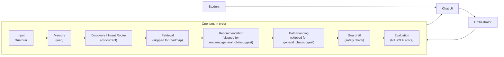
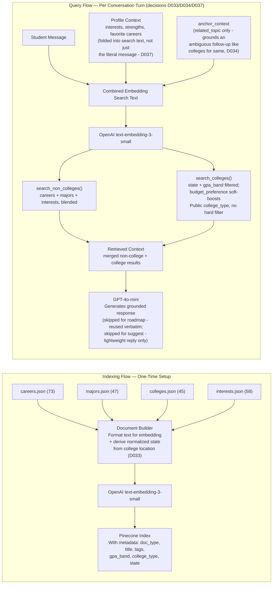
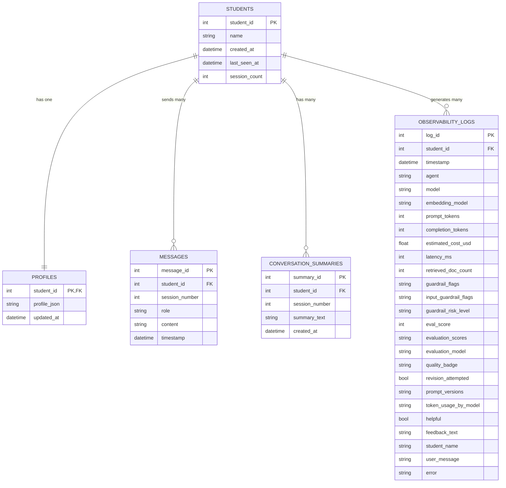
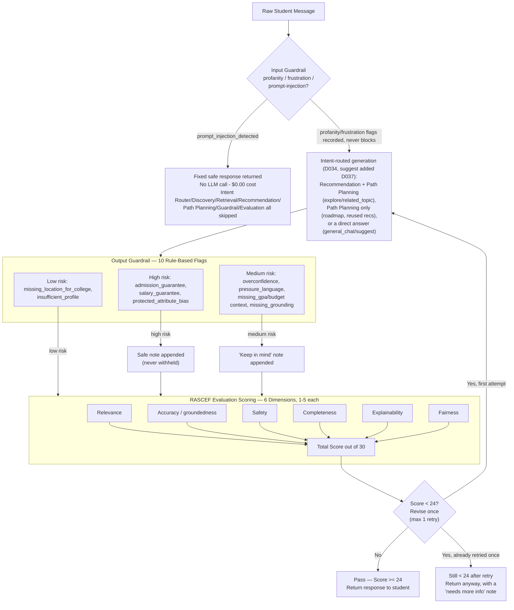
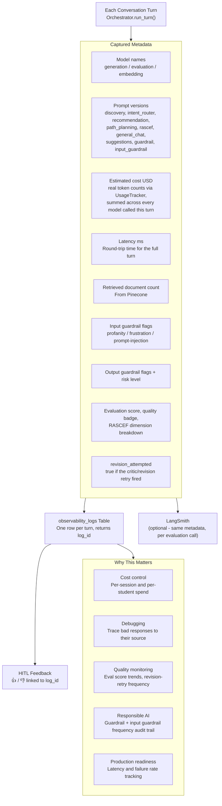
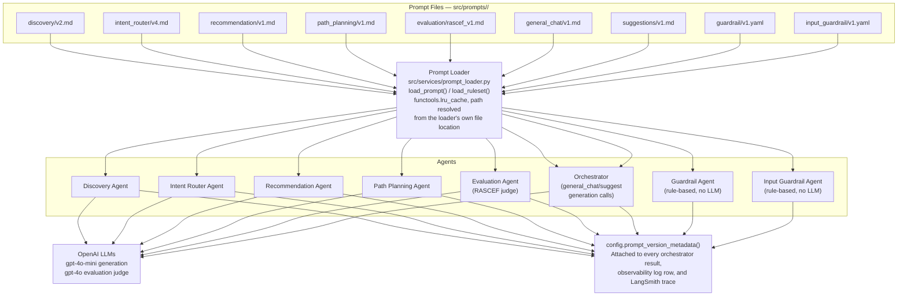

# PathFinder AI — Architecture and Sequence Diagrams

## At a Glance

**Read this one first.** Everything below is the detailed version — RAG internals, memory schema, guardrail rules, observability fields. This is just the call order, so the detailed diagrams have somewhere to hang.



Every box above is one of the 11 agents; every diagram below zooms into one part of this same path. Section 1 gives the exact sequence with the critic/revision retry, and Sections 2-6 go deep on one piece each (RAG, memory, guardrails, observability, prompt governance).

---

## 1. End-to-End Sequence Diagram

**What this shows:** The exact sequence of events for a single conversation turn — which component calls which, in what order, and what flows back to the student.

```mermaid
sequenceDiagram
    actor S as Student
    participant UI as Streamlit UI
    participant ORC as Orchestrator
    participant IGA as Input Guardrail Agent
    participant MA as Memory Agent
    participant IRA as Intent Router Agent
    participant DA as Discovery Agent
    participant RETA as Retrieval Agent
    participant EMB as OpenAI Embeddings
    participant PC as Pinecone
    participant RA as Recommendation Agent
    participant PPA as Path Planning Agent
    participant GA as Guardrail Agent
    participant EA as Evaluation Agent
    participant OL as Observability Logger
    participant LS as LangSmith (optional)
    S->>UI: Sends message
    UI->>ORC: Forwards message + session state
    ORC->>IGA: Check raw message (profanity / frustration / prompt injection)
    IGA-->>ORC: Flags (profanity/frustration detection only; prompt_injection blocks)
    ORC->>MA: Load student profile and conversation summary
    MA-->>ORC: Profile JSON + last 20 messages
    opt prompt_injection_detected fired
        ORC-->>UI: Return fixed safe response immediately - no LLM call, $0.00
        Note over ORC: Discovery/Intent Router/Retrieval/Recommendation/Path Planning/Guardrail/Evaluation all skipped
    end
    par Discovery and Intent Router run concurrently
        ORC->>DA: Update student understanding
        DA-->>ORC: Updated profile fields (interests, GPA, grade, location/budget preference)
    and
        ORC->>IRA: Classify intent (recent conversation + last turn's offered titles)
        IRA-->>ORC: intent (suggest/explore/roadmap/related_topic/general_chat) + anchor_title
    end
    ORC->>MA: Merge profile updates + persist
    MA-->>ORC: Merged profile
    Note over ORC: Resolve anchor_title against the merged profile's<br/>last_recommendations (decision D034). Falls back to<br/>"explore" if it can't be confidently resolved, or if<br/>"suggest" was returned with no prior conversation (D037).
    alt intent == roadmap
        Note over ORC: Skip Retrieval and Recommendation entirely -<br/>nothing new needs grounding.
        ORC->>PPA: Build roadmap around the resolved anchor item
        PPA-->>ORC: Roadmap
        Note over ORC: Response text: "Here's your roadmap for &lt;anchor&gt;."<br/>Recommendation cards are last turn's items, unchanged.
    else intent == general_chat
        ORC->>RETA: Retrieve context if relevant (no anchor)
        RETA-->>ORC: Retrieved documents (may be empty)
        ORC->>RA: (skipped - no structured recommendations for this turn)
        Note over ORC: Direct conversational answer, grounded by profile +<br/>history + retrieved context when relevant - no roadmap.
    else intent == suggest
        ORC->>RETA: Retrieve context (no anchor)
        RETA-->>ORC: Retrieved documents (careers/majors)
        ORC->>RA: (skipped - lightweight reply only, decision D037)
        Note over ORC: Short reply naming 2-4 career/major directions -<br/>no full detail, no colleges yet, no roadmap.
    else intent == explore or related_topic
        ORC->>RETA: Search (related_topic passes anchor_title/type as extra grounding)
        RETA->>EMB: Embed retrieval query (+ anchor context if set)
        EMB-->>RETA: Query vector
        RETA->>PC: Search non-colleges + colleges (state/gpa_band filtered, decision D033)
        PC-->>RETA: Career / Major / College context
        RETA-->>ORC: Retrieved documents
        ORC->>RA: Generate grounded recommendations
        Note over ORC,RA: System prompt includes profile + retrieved context<br/>+ anchor context (related_topic only)
        RA-->>ORC: Draft recommendations
        ORC->>PPA: Build phased roadmap (top recommendation)
        PPA-->>ORC: Roadmap
    end
    ORC->>GA: Check response for unsafe claims
    GA-->>ORC: Guardrail flags (if any)
    ORC->>EA: Score response quality (RASCEF; general_chat/suggest scored on<br/>answer substance, not recommendation structure)
    EA-->>ORC: Dimension scores (out of 30)
    EA->>LS: Trace (prompt versions, score, badge, guardrail + input guardrail flags)
    alt total_score < 24 (critic / revision loop, max 1 retry)
        Note over ORC: Re-runs only the branch that ran above (roadmap only<br/>retries Path Planning; general_chat/suggest only retry the answer)
        ORC->>GA: Re-check response
        GA-->>ORC: Guardrail flags (if any)
        ORC->>EA: Re-score (max one retry, accepted either way)
        EA-->>ORC: Final scores
        EA->>LS: Trace (revision_attempted: true)
    end
    opt intent not in (general_chat, suggest)
        ORC->>MA: Remember this turn's offered recommendations<br/>(for the next turn's intent routing)
        MA-->>ORC: Confirmed
    end
    ORC->>OL: Record latency, scores, flags, prompt versions
    OL-->>ORC: log_id
    ORC->>MA: Save message + update profile
    MA-->>ORC: Confirmed
    ORC->>UI: Return final response + trace + log_id
    UI->>S: Display response in chat
    opt Student rates the response
        S->>UI: 👍 / 👎
        UI->>ORC: submit_feedback(log_id, helpful)
        ORC->>OL: save_feedback(log_id, helpful)
    end
```

---

## 2. RAG Pipeline Diagram

**What this shows:** How the knowledge base is converted into searchable vectors (indexing) and how student queries retrieve relevant content at runtime (query). This is the core of grounded, non-hallucinated recommendations.



**Why this matters:** Without RAG, the LLM recommends careers from its training data — generic, unverifiable, and potentially hallucinated. With Pinecone retrieval, every recommendation is traceable to a specific document in the knowledge base. The system cannot recommend a career that does not exist in the curated dataset. The query side is intent-aware, not one-size-fits-all: `related_topic` grounds an ambiguous follow-up in what was actually being discussed, `related_topic`/`explore` fold in the student's already-known interests so a topically-thin message like "give me career choices" still retrieves relevant results, and college search specifically narrows by stated location/budget preferences rather than searching blind.

---

## 3. Memory Model Diagram

**What this shows:** The SQLite schema — five tables and how they relate to a single student. Memory is what transforms a one-time chatbot into a persistent counselor.



**Key design decisions:**
- Profile is a single `profile_json` blob column, not one column per field — the schema never needs a migration when a new profile attribute is added; only the JSON shape changes
- Messages are stored individually, tagged with `session_number` — enables conversation replay and context injection, and lets summaries be scoped to one session
- Summaries are session-level (`summary_text`, one row per `session_number`) — used to brief the LLM without injecting the full message history
- `observability_logs` started with a small base schema and grew by additive `ALTER TABLE` migrations (`_migrate_observability_logs()`) as new capabilities (RASCEF scores, prompt governance, HITL feedback, per-model token accounting) were added — never a destructive schema change
- Observability logs are tied to the student — enables per-student cost and quality analysis

---

## 4. Guardrail and Evaluation Flow

**What this shows:** What happens after the LLM generates a response and before it reaches the student. Safety checks and quality scoring are not optional — they run on every turn.



**Input guardrail blocking (decision D032):** `prompt_injection_detected` is the one input flag that actually stops the turn — the response never reaches Recommendation/Path Planning/output Guardrail/Evaluation at all, a fixed safe message is returned instead, and no LLM call is made (so a blocked turn costs $0.00). `profanity_detected`/`frustration_detected` remain detection-only, per D023's original scope.

**Scoring threshold:** 24 out of 30, computed deterministically from `total_score` (never trusted from the model). A response below threshold triggers exactly one regenerate-and-recheck retry (the critic/revision loop); if it is still below threshold after that retry, it is returned anyway with a "needs more information" note rather than withheld or retried further. Every attempt — including the retry — is logged to `observability_logs` and, if configured, traced to LangSmith.

---

## 5. Observability and Cost Tracking Diagram

**What this shows:** What is captured for every API call and where it goes. This is the instrumentation layer that makes the system understandable, debuggable, and cost-controllable.



**From an Engineering Manager perspective:** Observability is the difference between a system you trust and a system you hope works. Every logged field has a specific operational use case — prompt versions let you attribute a quality regression to a specific prompt change, latency flags UX regressions, guardrail frequency reveals misuse patterns, `revision_attempted` frequency reveals how often the critic loop is doing real work, and eval score trends reveal prompt drift before users notice it. Cost tracking reports a real per-turn estimate (decision D029) — `UsageTracker` sums token usage across every model called that turn (generation, evaluation, embedding, including a critic/revision retry) and `observability_logs.token_usage_by_model` holds the full per-model breakdown alongside the summed `estimated_cost_usd`.

---

## 6. Prompt Governance Architecture

**What this shows:** Every LLM-facing prompt is a versioned file on disk, not a hardcoded string — this is what makes prompt iteration safe and auditable (decision D020 in `docs/12_DECISION_LOG.md`).



**Active versions today:** `discovery_v2`, `intent_router_v4`, `recommendation_v1`, `path_planning_v1`, `rascef_v1` (evaluation), `general_chat_v1`, `suggestions_v1`, `guardrail_v1`, `input_guardrail_v1`. Each is independently configured via `.env` (`DISCOVERY_PROMPT_VERSION`, `INTENT_ROUTER_PROMPT_VERSION`, `RECOMMENDATION_PROMPT_VERSION`, `PATH_PLANNING_PROMPT_VERSION`, `EVALUATION_PROMPT_VERSION`, `GENERAL_CHAT_PROMPT_VERSION`, `SUGGESTIONS_PROMPT_VERSION`, `GUARDRAIL_RULESET_VERSION`, `INPUT_GUARDRAIL_RULESET_VERSION`) — bumping a prompt to a new version means adding a new file and changing one env var, no code change, and the previous version stays on disk for comparison or rollback. `discovery` reached v2 when location/budget preference extraction was added (D033); `intent_router` reached v4 after two real bugs found in testing - v2 fixed an anchor-title formatting echo (D035), v3 added the `suggest` intent, v4 fixed a classification boundary that broke the acceptance suite and the capstone's own demo script (D037).

**Why this matters for the capstone:** Prompt governance is what separates "I tuned a prompt until it worked" from "I can prove which prompt version produced which response, and roll back safely." The version tags aren't just logged — they're attached to every LangSmith trace, so a reviewer can filter by prompt version and see exactly how output quality changed between iterations.
