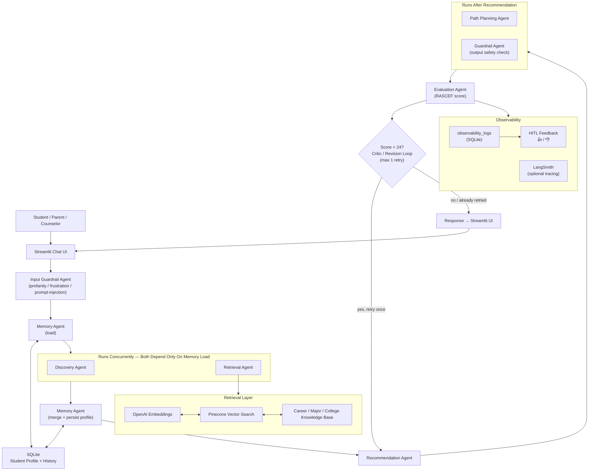
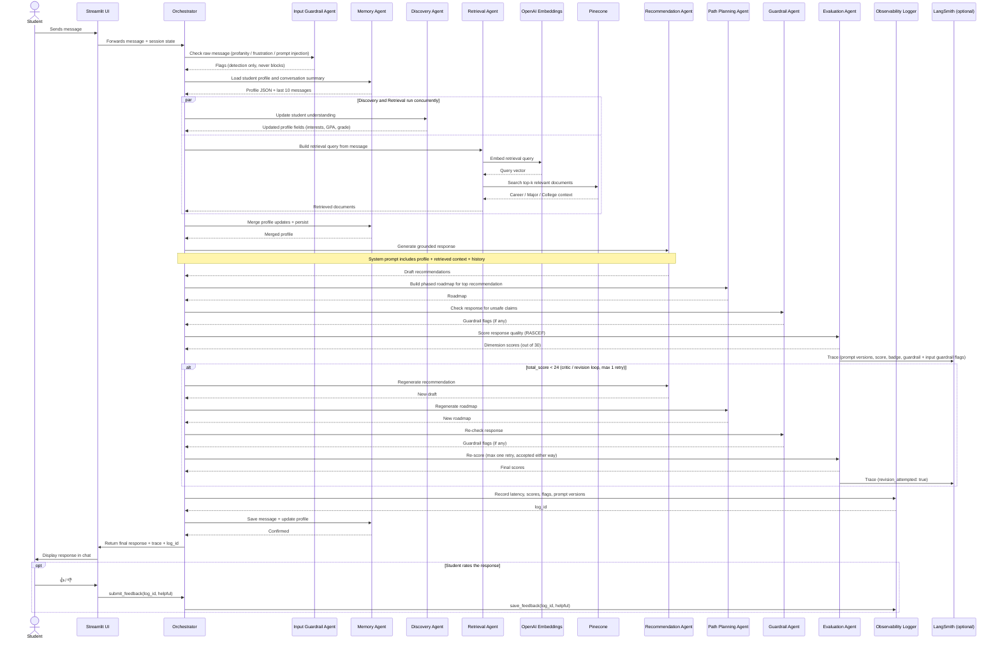
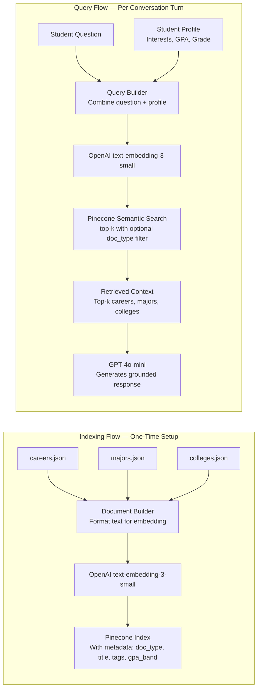
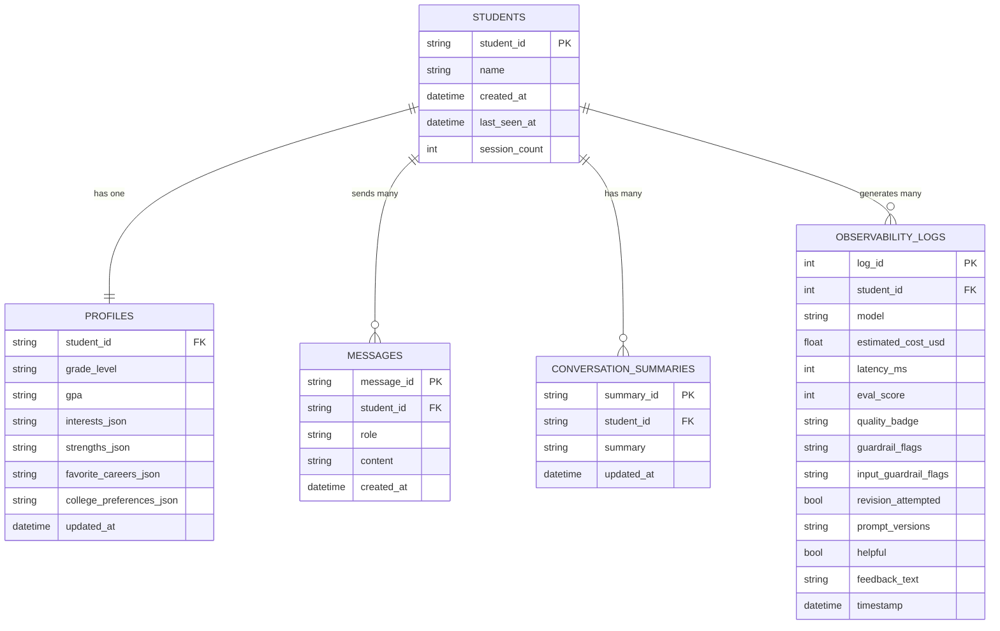
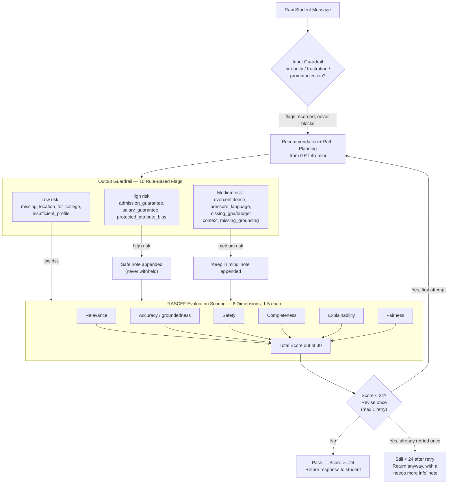
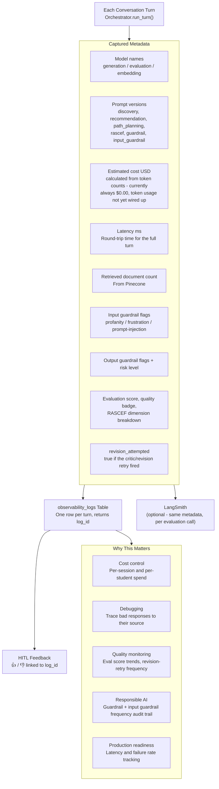
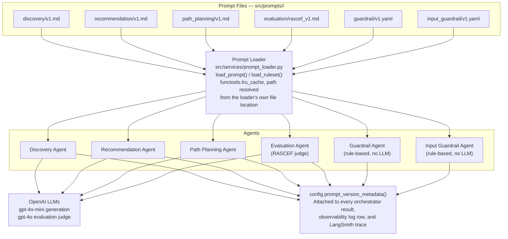
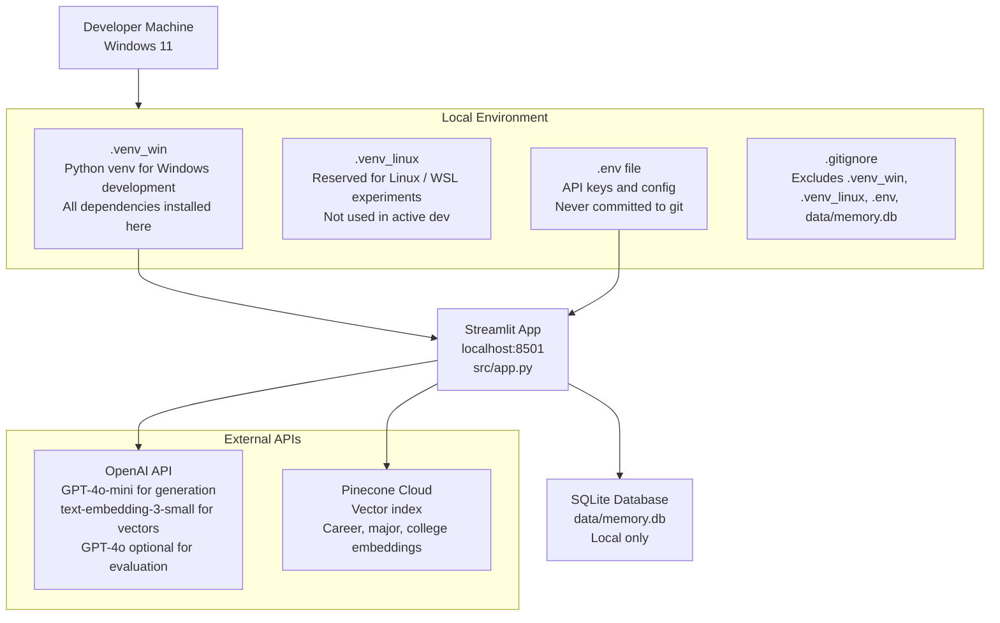

# PathFinder AI — Architecture and Sequence Diagrams

## 1. Why These Diagrams Matter

PathFinder AI is both a **career guidance product** and a **capstone AI system**. These diagrams serve two audiences:

- **Product audience** (students, parents, counselors, evaluators): Shows what the system does and how it flows
- **Technical audience** (capstone reviewers, engineering peers): Shows that the system implements real AI engineering patterns — RAG, memory, guardrails, evaluation, observability, and cost tracking

Use these diagrams in the capstone presentation to move from "I built a chatbot" to "I designed and implemented a multi-agent AI system."

---

## 2. High-Level System Architecture

**What this shows:** The full system layered top to bottom — from the student interface down through orchestration, retrieval, agents, safety checks, and memory. Each layer has a distinct responsibility.

**Layer summary:**
- **Streamlit UI** — Chat interface; no business logic lives here
- **Orchestrator** — Central controller; coordinates all 10 agents in sequence (with one concurrent step) per turn
- **Input Guardrail Agent** — Pre-generation, rule-based check on the raw message (profanity/frustration/prompt-injection); detection only, never blocks
- **Memory Agent** — Reads student profile and history at turn start; merges and persists updates after Discovery; writes the turn at turn end
- **Discovery Agent** and **Retrieval Agent** — Run concurrently on worker threads: Discovery extracts interests/GPA/grade/dislikes from the message; Retrieval builds a semantic query, embeds it, and fetches top-k docs from Pinecone. Neither depends on the other's output
- **Recommendation Agent** — Generates grounded career, major, and college pathway response using retrieved context
- **Path Planning Agent** and **Guardrail Agent** — Path Planning builds the phased roadmap; the Guardrail Agent runs a rule-based post-generation safety check (10 flags)
- **Evaluation Agent** — Scores the response on the 6 RASCEF dimensions; scores below 24/30 trigger one automatic regenerate-and-recheck retry (the critic/revision loop), never more than one
- **Observability** — Every turn logs to SQLite (`observability_logs`), optionally traces to LangSmith, and exposes 👍/👎 HITL feedback wired to that same log row

---

## 3. End-to-End Sequence Diagram

**What this shows:** The exact sequence of events for a single conversation turn — which component calls which, in what order, and what flows back to the student.

---

## 4. RAG Pipeline Diagram

**What this shows:** How the knowledge base is converted into searchable vectors (indexing) and how student queries retrieve relevant content at runtime (query). This is the core of grounded, non-hallucinated recommendations.

**Why this matters:** Without RAG, the LLM recommends careers from its training data — generic, unverifiable, and potentially hallucinated. With Pinecone retrieval, every recommendation is traceable to a specific document in the knowledge base. The system cannot recommend a career that does not exist in the curated dataset.

---

## 5. Memory Model Diagram

**What this shows:** The SQLite schema — five tables and how they relate to a single student. Memory is what transforms a one-time chatbot into a persistent counselor.

**Key design decisions:**
- Profile is stored as JSON blobs — flexible enough to evolve without schema migrations
- Messages are stored individually — enables conversation replay and context injection
- Summaries are session-level — used to brief the LLM without injecting the full message history
- Observability logs are tied to the student — enables per-student cost and quality analysis

---

## 6. Agent Responsibility Diagram

**What this shows:** What each agent is responsible for and how they are coordinated. The Orchestrator is the hub — no agent runs independently.

```mermaid
flowchart TD
    ORC["Orchestrator\nCoordinates all 10 agents in sequence\n(with one concurrent step)"]

    subgraph IGA_box ["Input Guardrail Agent"]
        IGA1["Detect profanity"]
        IGA2["Detect frustration"]
        IGA3["Detect prompt-injection attempts"]
        IGA4["Detection only - never blocks the message"]
    end

    subgraph MA_box ["Memory Agent"]
        MA1["Read profile and history at turn start"]
        MA2["Merge and persist profile after Discovery"]
        MA3["Write message at turn end"]
    end

    subgraph DA_box ["Discovery Agent"]
        DA1["Extract interests, strengths, GPA, grade level"]
        DA2["Never invents GPA or grade level"]
        DA3["Runs concurrently with Retrieval"]
    end

    subgraph RETA_box ["Retrieval Agent"]
        RETA1["Build semantic query from the message"]
        RETA2["Generate OpenAI embedding for query"]
        RETA3["Fetch top-k career / major / college docs from Pinecone"]
        RETA4["Runs concurrently with Discovery"]
    end

    subgraph RA_box ["Recommendation Agent"]
        RA1["Generate response grounded in retrieved context"]
        RA2["Cover careers, majors, and college pathway guidance"]
        RA3["Explain why each recommendation fits this student"]
    end

    subgraph PPA_box ["Path Planning Agent"]
        PPA1["Build a phased roadmap for the top recommendation"]
        PPA2["Short-term, medium-term, long-term steps"]
    end

    subgraph GA_box ["Guardrail Agent"]
        GA1["Block admission / salary guarantees"]
        GA2["Prevent protected-attribute bias"]
        GA3["Flag missing GPA / budget / location context"]
        GA4["Flag ungrounded recommendations"]
    end

    subgraph EA_box ["Evaluation Agent"]
        EA1["RASCEF: relevance, accuracy, safety"]
        EA2["RASCEF: completeness, explainability, fairness"]
        EA3["Flag responses below 24 out of 30"]
        EA4["Trigger the critic/revision retry (max 1)"]
    end

    subgraph OBS_box ["Observability Agent"]
        OBS1["Log every turn to SQLite"]
        OBS2["Return log_id for HITL feedback"]
        OBS3["Optional LangSmith trace"]
    end

    ORC --> IGA_box
    ORC --> MA_box
    ORC --> DA_box
    ORC --> RETA_box
    ORC --> RA_box
    ORC --> PPA_box
    ORC --> GA_box
    ORC --> EA_box
    ORC --> OBS_box
```

---

## 7. Guardrail and Evaluation Flow

**What this shows:** What happens after the LLM generates a response and before it reaches the student. Safety checks and quality scoring are not optional — they run on every turn.

**Scoring threshold:** 24 out of 30, computed deterministically from `total_score` (never trusted from the model). A response below threshold triggers exactly one regenerate-and-recheck retry (the critic/revision loop); if it is still below threshold after that retry, it is returned anyway with a "needs more information" note rather than withheld or retried further. Every attempt — including the retry — is logged to `observability_logs` and, if configured, traced to LangSmith.

---

## 8. Observability and Cost Tracking Diagram

**What this shows:** What is captured for every API call and where it goes. This is the instrumentation layer that makes the system understandable, debuggable, and cost-controllable.

**From an Engineering Manager perspective:** Observability is the difference between a system you trust and a system you hope works. Every logged field has a specific operational use case — prompt versions let you attribute a quality regression to a specific prompt change, latency flags UX regressions, guardrail frequency reveals misuse patterns, `revision_attempted` frequency reveals how often the critic loop is doing real work, and eval score trends reveal prompt drift before users notice it. Cost tracking is implemented but currently always reports $0.00 — `OpenAIClient` doesn't yet surface token usage (a documented, non-blocking limitation).

---

## 9. Prompt Governance Architecture

**What this shows:** Every LLM-facing prompt is a versioned file on disk, not a hardcoded string — this is what makes prompt iteration safe and auditable (decision D020 in `docs/12_DECISION_LOG.md`).

**Active versions today:** `discovery_v1`, `recommendation_v1`, `path_planning_v1`, `rascef_v1` (evaluation), `guardrail_v1`, `input_guardrail_v1`. Each is independently configured via `.env` (`DISCOVERY_PROMPT_VERSION`, `RECOMMENDATION_PROMPT_VERSION`, `PATH_PLANNING_PROMPT_VERSION`, `EVALUATION_PROMPT_VERSION`, `GUARDRAIL_RULESET_VERSION`, `INPUT_GUARDRAIL_RULESET_VERSION`) — bumping a prompt to a new version means adding a new file and changing one env var, no code change, and the previous version stays on disk for comparison or rollback.

**Why this matters for the capstone:** Prompt governance is what separates "I tuned a prompt until it worked" from "I can prove which prompt version produced which response, and roll back safely." The version tags aren't just logged — they're attached to every LangSmith trace, so a reviewer can filter by prompt version and see exactly how output quality changed between iterations.

---

## 10. Deployment and Environment Diagram

**What this shows:** How the development environment is structured, what secrets are managed, and which external services the app depends on.

**Environment notes:**
- `.venv_win` is the active virtual environment for Windows development — activate with `.venv_win\Scripts\activate`
- `.venv_linux` is reserved for future Linux or WSL work — kept separate to avoid dependency conflicts
- `.env` stores `OPENAI_API_KEY`, `PINECONE_API_KEY`, and `PINECONE_INDEX_NAME` — loaded at startup via `python-dotenv`
- `.gitignore` must explicitly exclude `.venv_win/`, `.venv_linux/`, `.env`, and `data/memory.db` before the first commit

---

## 11. Suggested Presentation Story

Use this speaking sequence when presenting the diagrams. Each step maps to one diagram above.

**Step 1 — Open with the product problem** *(no diagram needed)*
> "High school students face major decisions about careers and college with very little personalized support. School counselors are stretched across hundreds of students. Career quizzes give generic results. PathFinder AI is a conversational AI counselor that meets students where they are."

**Step 2 — Show the system architecture** *(Diagram 2)*
> "Here is the full system. A student types a message into the Streamlit chat interface. The Orchestrator takes over — it loads the student's memory, calls the right agents, retrieves relevant knowledge, checks the response for safety, scores it for quality, and logs everything. The student only sees the final, grounded response."

**Step 3 — Show the RAG pipeline** *(Diagram 4)*
> "The knowledge base contains curated careers, majors, and college pathways. At setup, every document is embedded using OpenAI and stored in Pinecone. At runtime, the student's interests and question are embedded and used to search Pinecone semantically. The top results are injected into the prompt — so every recommendation is grounded in real data, not hallucination."

**Step 4 — Show the memory model** *(Diagram 5)*
> "Memory is what transforms a one-time chatbot into a persistent counselor. The student profile evolves across sessions — interests, GPA, and favorite careers are updated incrementally. A returning student is recognized by name, greeted with context, and never asked to repeat themselves."

**Step 5 — Show guardrails, evaluation, and the revision loop** *(Diagrams 2 and 7)*
> "Every message is checked twice: an input guardrail flags profanity, frustration, or prompt-injection attempts before the student's message is even processed, and an output guardrail catches unsafe claims after generation — no admission guarantees, no fabricated salary figures, no protected-attribute bias. Evaluation scoring gives each response a RASCEF quality score across six dimensions — Relevance, Accuracy, Safety, Completeness, Explainability, Fairness. If the score comes in below 24 out of 30, the system automatically regenerates the response once and re-checks it — a critic/revision loop, capped at a single retry, so quality control is not just a report card, it's a second chance."

**Step 6 — Show prompt governance** *(Diagram 9)*
> "Every prompt this system sends to an LLM lives in a versioned file, not a hardcoded string. That means every response can be traced back to the exact prompt version that produced it, prompts can be improved without touching code, and a bad version can be rolled back instantly."

**Step 7 — Show observability, feedback, and cost** *(Diagram 8)*
> "Every turn is logged — model, latency, retrieved document count, guardrail flags, evaluation score, and prompt versions. Students can also rate any response with a thumbs up or down, linked directly to that log row. This is how you run an AI system responsibly — not by hoping it works, but by measuring it and listening to feedback."

**Step 8 — Close with the capstone framing** *(no diagram needed)*
> "This is not a chatbot. It is a multi-agent AI system with RAG, memory, layered guardrails, LLM-as-judge evaluation with an automatic revision loop, governed and versioned prompts, observability, and human-in-the-loop feedback — demonstrated through a real use case that matters to real students."

---

## 12. Diagram Usage Notes

### Where Each Diagram Belongs

| Diagram | BRD / PRD | Architecture Doc | Presentation | README | Demo Walkthrough |
|---|---|---|---|---|---|
| 2. High-Level Architecture | ✓ | ✓ | ✓ | ✓ | ✓ |
| 3. Sequence Diagram | | ✓ | ✓ | | ✓ |
| 4. RAG Pipeline | | ✓ | ✓ | | ✓ |
| 5. Memory Model | | ✓ | ✓ | | |
| 6. Agent Responsibilities | | ✓ | ✓ | | |
| 7. Guardrail and Evaluation | ✓ | ✓ | ✓ | | |
| 8. Observability and Cost | | ✓ | ✓ | | ✓ |
| 9. Prompt Governance Architecture | | ✓ | ✓ | ✓ | |
| 10. Deployment / Environment | | | | ✓ | |

### How to Render These Diagrams

Mermaid diagrams in this file can be rendered using any of the following:

- **GitHub** — Mermaid is natively rendered in `.md` files on GitHub
- **VS Code** — Install the "Markdown Preview Mermaid Support" extension; use `Ctrl+Shift+V` to preview
- **Mermaid Live Editor** — Paste diagram code at `mermaid.live` for instant rendering and export
- **Notion** — Paste as a code block with language set to `mermaid`
- **Obsidian** — Native Mermaid support in preview mode
- **Docusaurus / MkDocs** — Both support Mermaid with a plugin; useful if docs are published

### Diagram Maintenance

- Update diagrams when the architecture changes — stale diagrams are worse than no diagrams
- The sequence diagram (Section 3) and the guardrail flow (Section 7) are most likely to evolve as implementation details are finalized
- The memory model diagram (Section 5) should stay in sync with `src/infrastructure/sqlite_client.py`'s schema (`create_tables()` and `_OBSERVABILITY_LOG_ADDITIVE_COLUMNS`)
- The prompt governance diagram (Section 9) should stay in sync with `config.prompt_version_metadata()` whenever a new prompt category is added
- Diagram source lives here in `docs/08_Diagrams.md` — treat it as the single source of truth for visual architecture
