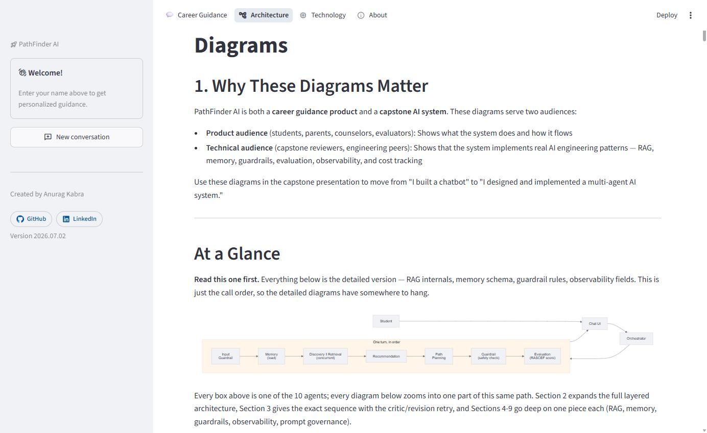
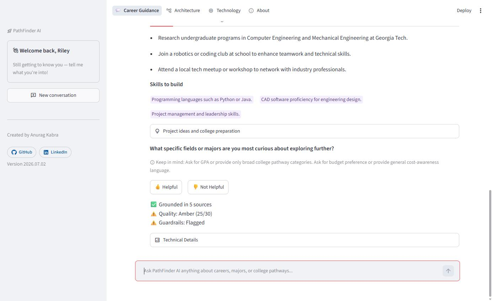
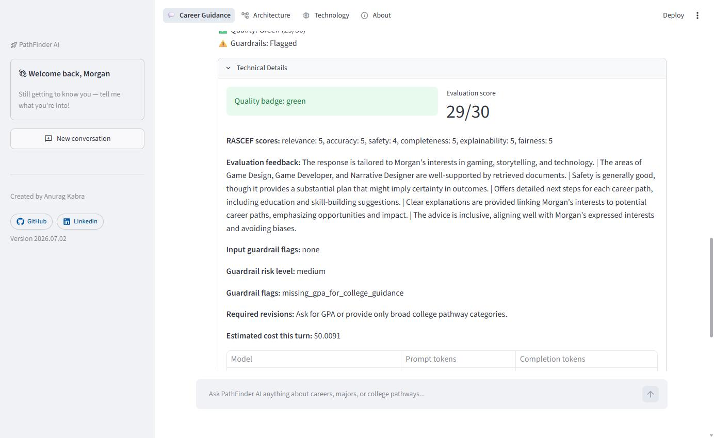
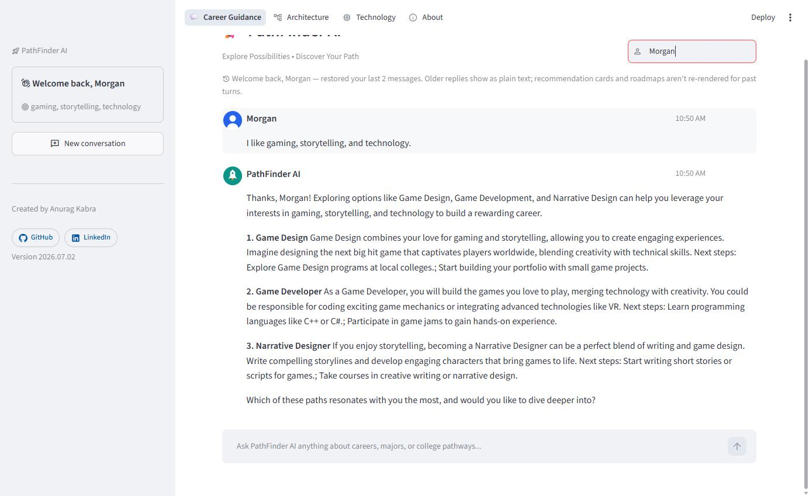

<!--
HOW TO USE THIS FILE - this file is two things in one:
1. A Marp slide deck (slides 1-17 below). Open it in VS Code with the free "Marp for VS
   Code" extension for a live preview, or render it with marp-cli:
   npx @marp-team/marp-cli docs/14_Presentation_Deck.md --pptx  (also supports --pdf, --html)
   It's still plain markdown underneath - edit it in any text editor.
2. A reference appendix (after slide 17) with the storyboard, demo script, visual-asset
   map, and a recommendation on cutting slides for time - clearly marked "Appendix - not
   for the 10-minute talk," meant to be skipped past when actually presenting.
Slides 13-16 (Rubric Coverage -> Operationalization) are a rubric-evidence deep dive aimed
at asynchronous grading, not stage time - Appendix D recommends skipping them live and
covering that ground with slide 12 alone when the talk is timed to 10 minutes.
Grounded in the actual pathfinder-ai codebase as of 2026.07.30 - no invented features.
Screenshots referenced below are real, captured live and saved to docs/assets/deck/.
-->

<!-- _class: lead -->

# 🚀 PathFinder AI
### Explore Possibilities. Discover Your Path.

**A Multi-Agent AI Career Counselor for High School Students**

Anurag Kabra · Capstone Project

<!--
Speaker notes (30-45s):
Hi, I'm Anurag. Over the next 10 minutes I'll show you PathFinder AI — a career and college
guidance counselor built as a multi-agent AI system, not a single prompt in a chat window.
It's for high school students who don't know what careers exist beyond doctor, lawyer, or
engineer, and it's built to demonstrate real production AI patterns: memory, retrieval,
safety guardrails, automated quality evaluation, and observability, all working together.
Let's start with the problem it's solving.
Transition: "So why does a student need this in the first place?"
-->

---

# The Problem

- School counselors: **400+ students each** on average — no room for 1:1 guidance
- Most students don't know careers exist beyond the obvious ones
- Career aptitude quizzes give generic results with **no follow-through**
- GPA reality often goes unaddressed until application season — too late to act on

**Personalized career guidance doesn't scale with people alone.**

<!--
Speaker notes (40-50s):
These aren't abstract numbers — a 400-to-1 counselor ratio means most students get maybe
one short conversation a year about their future, if that. Career quizzes hand back a
generic label like "Investigative type" and nothing actionable. And GPA-aware guidance —
the thing that actually determines what's realistic — usually shows up for the first time
during application season, when it's too late to course-correct. The gap isn't information,
it's personalized, ongoing conversation. That's exactly what an AI counselor can offer if
it's built right — which is the point of the rest of this talk.
Transition: "So what did we actually build?"
-->

---

# The Solution

**PathFinder AI** — a chat-first AI counselor that:

- **Remembers** each student across visits, not just within one session
- **Grounds** every recommendation in a real, curated knowledge base
- **Checks its own answers** for safety and quality before responding
- Turns "what fits me?" into a **concrete next-step roadmap**

10 specialized agents. One conversation.

<!--
Speaker notes (40-50s):
PathFinder AI is chat-first — a student just talks about what they're into. Under the hood,
it's not one prompt; it's 10 specialized agents coordinating on every single message: one
extracts profile facts, one retrieves grounded knowledge, one generates recommendations, one
builds a roadmap, two run safety/quality checks, and more. The student never sees that
complexity — they just see a counselor that remembers them, doesn't make things up, and
gives them something concrete to do next. Let's look at how that's actually built.
Transition: "Here's the architecture behind that."
-->

---

## Architecture, End to End

Clean Architecture, 6 layers:

**Presentation → Agents → Services → Repositories → Infrastructure → Domain**

- SOLID — every dependency injected, nothing hardwired
- Agents never touch a database or SDK directly

<!--
Speaker notes (40-50s):
This is a production-style layered architecture, not a script. The Streamlit UI knows
nothing about OpenAI or SQLite — it only talks to an Orchestrator. Agents depend on
service abstractions injected at construction time, so an agent's LLM call could be swapped
from GPT-4o-mini to another provider without touching agent code. That's dependency
inversion in practice, not just a slide term. On the right is the actual turn-by-turn flow —
every one of the 10 agents in call order, which is what we'll walk through next.
Transition: "Let's zoom into what happens on a single message."
-->

---

# One Conversation Turn

**Input Guardrail → Memory Load → Discovery ‖ Retrieval → Recommendation → Path Planning → Guardrail → Evaluation → (retry once, if needed) → Observability → Memory Save**

- Discovery and Retrieval run **concurrently** — independent work, no wasted latency
- A low quality score triggers **one** automatic regenerate-and-recheck, never more

<!--
Speaker notes (35-45s):
Every message goes through this exact sequence. Discovery (extracting interests, GPA,
grade level) and Retrieval (semantic search) don't depend on each other, so they run on
separate threads concurrently — shaving real latency off every turn for zero behavior
change. If the quality score comes back low, the system regenerates once automatically —
a bounded critic loop, not an infinite retry. This sequence is what makes PathFinder AI
verifiably multi-agent, not one big prompt with section headers.
Transition: "None of this matters if the recommendations aren't grounded in something real."
-->

---

## Grounded, Not Guessed

- **223 curated documents**: 73 careers, 47 majors, 45 colleges, 58 interest areas
- Embedded with OpenAI (`text-embedding-3-small`), searched via **Pinecone**
- **Metadata strategy**: `doc_type` + `gpa_band` + `state` filtering in one index, one namespace — no separate indexes to keep in sync
- **Retrieval filtering**: top-k=5 by default, split into a non-college search plus a college search that's state-aware (from a stated location preference) and budget-aware (a soft public/private boost, since there's no real per-college cost data)
- **Grounding verification**: every recommendation carries an `evidence` field pointing at the retrieved document behind it — a guardrail flag fires if one has none
- Falls back to local tag search if Pinecone is unreachable

**Every recommendation traces to a real document — never invented.**

<!--
Speaker notes (50-60s):
This is the RAG layer, and it's the difference between a career counselor and a career
hallucinator. Every career, major, and college in this system comes from a curated
dataset — not the model's training data — retrieved from Pinecone using OpenAI embeddings.
Two things make this more than "just search everything": metadata strategy — one Pinecone
index, one namespace, filtered by document type, GPA band, and now state instead of
juggling separate indexes — and query-time retrieval filtering, so a major-specific
question only searches major documents, and a stated location or budget preference
actually narrows and re-ranks the colleges that come back, not just the same unfiltered
list every time. And grounding isn't just claimed: every recommendation carries an evidence
field pointing at the actual retrieved document, and a dedicated guardrail flag fires if one
doesn't have it. If Pinecone is ever unreachable, it degrades gracefully to a local
tag-based search instead of failing outright.
Transition: "Grounding handles accuracy — now let's talk about safety."
-->

---

## Responsible AI, By Design

- **Input guardrails**: profanity, frustration detect only — prompt-injection actually blocks
- **Output guardrails**: 10 rules — no admission/salary guarantees, no bias
- **RASCEF**: 6-dimension LLM-as-judge score, every turn
- **Revision loop**: auto-regenerates once if quality falls short

<!--
Speaker notes (45-55s):
Safety runs twice — before generation and after. Before: a rule-based check flags
profanity, frustration, or prompt-injection attempts. Profanity and frustration are
detection-only, purely for visibility. Prompt-injection is the exception — it actually
blocks the turn, returning a fixed safe response with no LLM call made at all, so it costs
nothing. After generation: 10 rule-based flags catch things like admission guarantees,
salary promises, or missing GPA context before college advice — you can see that exact
note live on the right, flagged in amber. Then RASCEF — Relevance, Accuracy, Safety,
Completeness, Explainability, Fairness — scores the response out of 30 using GPT-4o as a
judge, with a rule-based fallback if that call fails. Below 24 out of 30, it regenerates
once automatically before the student ever sees it.
Transition: "All of that needs to be traceable — that's where prompt governance and
observability come in."
-->

---

## Governed and Observed

- Every prompt is a **versioned file**, never hardcoded — swap via one env var, instant rollback
- Every turn logs latency, flags, score, and **real per-model cost**
- **LangSmith tracing** (optional): every reasoning stage traces itself via one shared, constructor-injected `TracingService` — auto-tagged with prompt versions and retry status, no per-call boilerplate
- **Golden evaluation dataset**: 10 mock student profiles, 9 scripted scenarios (`docs/11`) — supports manual prompt tuning today, dataset-based automated eval is next
- Versioned prompts + logged decisions + 👍/👎 feedback are the substrate the improvement loop runs on

<!--
Speaker notes (50-60s):
Two things reviewers usually ask about: can you explain why a response changed, and what
does this actually cost? Every prompt — discovery, recommendation, path planning, the
RASCEF judge — lives in a versioned file, so a prompt edit is a new file, not an
overwritten one, and it's fully rollback-able. On the right, that's a real per-turn cost
breakdown, not a placeholder — it sums actual token usage across every model called that
turn, including a retry, broken down per model. When LangSmith is enabled, every stage in
the turn traces itself through the same injected TracingService, auto-tagged with the exact
prompt versions and retry status, with no extra code at each call site. There's also a
10-profile, 9-scenario golden evaluation
dataset used for manual prompt tuning today — LangSmith dataset-based evaluation against
those same scenarios is the natural next step, covered later in What's Next.
Transition: "So what does that actually feel like for a student?"
-->

---

## What Makes It Feel Like a Counselor

- **Memory** — returning students pick up right where they left off
- **Choice-aware roadmaps** — anchored to what the student actually picked
- **Human feedback** — 👍/👎 on every response
- **Grounded picks** — with fun facts and a future outlook

<!--
Speaker notes (35-45s):
This is the payoff of everything so far. On the right — that's a real returning student.
Same name, new session, and PathFinder AI already knows their interests and picks the
conversation back up. The roadmap step is similarly responsive: if a student answers "which
of these resonates with you" by naming one of the options, the roadmap is built around
that specific choice — not just whichever option an internal priority order would have
picked. That's the difference between a static recommender and something that actually
listens.
Transition: "Before the demo, here's the plain list of AI concepts all of that represents."
-->

---

## AI Concepts, Named

- **Multi-agent orchestration** — 10 agents, one central Orchestrator, no peer-to-peer agent calls
- **RAG** (Retrieval-Augmented Generation) — Pinecone + OpenAI embeddings ground every claim
- **Persistent memory** — SQLite profile + conversation history survive across sessions
- **Guardrails** — rule-based input/output safety checks, every single turn
- **Evaluation** — RASCEF, 6-dimension LLM-as-judge scoring, bounded auto-retry
- **Observability & cost tracking** — per-call tokens, latency, real cost, all logged
- **Prompt engineering & versioning** — prompts as versioned files, swappable via env var
- **Structured outputs** — Pydantic-typed profile, retrieval metadata throughout

*Not used (yet): peer-to-peer agent-to-agent messaging (e.g. an A2A protocol) — coordination is intentionally orchestrator-hub today. See "What's Next" for when that changes.*

<!--
Speaker notes (30-40s):
Everything in the last five slides maps to a named pattern, so here's the checklist plainly:
multi-agent orchestration, RAG, memory, guardrails, evaluation, observability, prompt
versioning, structured outputs. One honest clarification since it's a common question —
agents don't message each other directly. Everything is coordinated through one central
Orchestrator, hub-and-spoke, not a peer-to-peer agent-to-agent protocol. That's deliberate,
not a gap — I'd only add real A2A-style messaging if a genuine cross-system need for it
showed up, which is covered on the roadmap slide later.
Transition: "Let's stop talking about it and just show you."
-->

---

<!-- _class: lead -->

# Live Demo

1. **"I like gaming, storytelling, and technology."**
2. **"I want college recommendations but don't know my GPA."**
3. A returning student, remembered.

<!--
Speaker notes (5-10s, then switch to the browser):
Three quick scenarios: a fresh discovery conversation, a guardrail firing live on a
GPA-sensitive question, and a returning student being recognized instantly. Full script
for each is in the appendix at the end of this file. Switch to the browser now.
Transition (after demo): "Let's close with where this stands and what's next."
-->

---

# Where It Stands

- Verified with **13 scripted end-to-end/integration tests** across every agent
- RASCEF pass threshold: **24/30** — auto-retry below that, always logged either way
- **33 documented architecture decisions** (`D001`–`D033`), each with alternatives considered
- Known gap, stated plainly: no automated `pytest` suite yet — verification is manual-script-based

<!--
Speaker notes (30-40s):
A few honest numbers instead of a vibe: 13 scripted tests cover the full workflow, the
revision loop, human feedback, prompt versioning, and observability, run against live
APIs rather than mocks. Every architecture and product decision — 33 of them — is logged
with what alternative was considered and why it lost, which is what makes this auditable
rather than "trust me." And I'll say the quiet part out loud: there's no automated pytest
suite yet, verification today is manual-script-based. That's a real gap, not glossed over.
Transition: "Let's go one level deeper, category by category, for anyone grading this
against a rubric."
-->

---

<!--
Slides 13-16: rubric-evidence deep dive. Written for asynchronous grading, not stage time -
see Appendix D for the recommended live-talk cut (skip straight from slide 12 to slide 17).
-->

## Rubric Coverage

| Category | Implemented | Evidence |
|---|---|---|
| Multi-Agent | ✅ | 10 agents + orchestrator, documented contracts (`docs/09`), 7/7 live acceptance run |
| Tool Calling | ✅ | Agents invoke Pinecone retrieval, SQLite persistence, and OpenAI inference through injected service abstractions — never a raw SDK call |
| RAG | ✅ | Pinecone + OpenAI embeddings, 223 docs, metadata filtering (incl. state/budget-aware college search, D033), tested local fallback |
| Guardrails | ✅ | Output guardrails enforce (all 10 flags reachable as of D033 - the budget/location flags can now both fire and clear on real profile data); input guardrails block on prompt-injection, detect-only on profanity/frustration by design |
| Evaluation | ✅ | RASCEF LLM-as-judge + rule-based fallback, 24/30 threshold, bounded retry (tested) |
| Structured Outputs | ✅ | JSON contracts everywhere; reference Pydantic models exist, not yet runtime-enforced |
| Observability | ✅ | Real per-model cost, full per-turn logging, optional LangSmith |
| Operationalization | ⚠️ Partial | No CI / automated pytest suite; manual scripts only; no deployment story |
| Improvement Loop | ⚠️ Partial | Per-turn auto-retry implemented + tested; cross-session prompt versioning exists, not yet exercised with a real v2 |

<!--
Speaker notes (50-60s):
This is the honest version of "what does the rubric actually see," not a highlight reel.
Six categories are fully green — multi-agent design, tool calling, RAG, evaluation,
structured outputs, and observability — each backed by real code and, for several, a live
test run from earlier today. Tool calling specifically means agents never call Pinecone,
OpenAI, or SQLite directly — every call goes through an injected service, which is what
makes swapping a provider or mocking a test possible without touching agent code. Three are
marked partial, deliberately: guardrails, because profanity and frustration on the input
side remain detection-only by design and two output flags can't fire yet since the profile
fields they depend on aren't populated — prompt-injection is the one input flag that
actually blocks, added after a review question about exactly this; operationalization, because there's no CI or automated test
gate; and the improvement loop, because the automatic per-turn retry is implemented and
tested, but the cross-session prompt-versioning story hasn't been exercised with an actual
second prompt version yet. Marking these partial instead of green is the point — it's more
credible than claiming everything's finished.
Transition: "Let's go one level deeper on evaluation specifically."
-->

---

## Evaluation Framework

**Method 1 — RASCEF (LLM-as-judge)**
- GPT-4o scores 6 dimensions, 1-5 each: Relevance, Accuracy, Safety, Completeness, Explainability, Fairness
- Pass threshold: **24/30** — badge: green (26-30), amber (21-25), red (0-20)
- Instructed not to be generous — marks down unsafe/unsupported answers even if fluent

**Method 2 — Rule-based validation (fallback)**
- Runs when the judge call fails: scores from heuristics — grounding evidence present, guardrail risk level, next steps present
- Capped at **amber** even on a perfect heuristic score — a degraded evaluation is never shown as fully judged

**Sample results (live run, this review session):** 30, 28, 28, 27, 28, 29 (out of 30) — all green; one scenario flagged medium-risk for a missing GPA, then cleared automatically once GPA was shared

<!--
Speaker notes (55-60s):
Two evaluation methods, not one. The primary path is RASCEF — six dimensions, scored 1 to 5
by GPT-4o acting as a judge, out of 30, with a 24-point pass threshold and a badge computed
deterministically in code, never trusted from the model's own opinion. The judge is
explicitly instructed not to be generous — a fluent but unsafe or unsupported answer gets
marked down on safety or accuracy specifically. If that judge call fails, a rule-based
fallback scores the same six dimensions from heuristics — grounding evidence, guardrail
risk, presence of next steps — and it's deliberately capped at amber even if its own score
would be green, so a degraded evaluation is never mistaken for a fully-judged one. These
aren't hypothetical numbers — a live acceptance run during this review scored 27 to 30 out
of 30 across five scenarios, and correctly flagged a medium-risk guardrail on a college
question with no GPA, then cleared that same flag automatically once GPA was shared.
Transition: "So what happens when a score comes in low?"
-->

---

## Continuous Improvement Loop

**Automatic, per turn — implemented and tested:**

Cycle 1 → RASCEF score < 24 → regenerate recommendation + path plan → Cycle 2 → re-score

- Example (`test_revision_loop.py`, scripted): **18/30 → retry → 27/30** (pass)
- Bounded to exactly one retry — a still-low case (10 → 15) is accepted and flagged, never looped indefinitely

**Human-directed, across sessions — infrastructure exists, not yet exercised:**

Versioned prompts (`v1` → `v2`) + Decision Log + 👍/👎 feedback → compare scores → ship the better version

<!--
Speaker notes (55-60s):
There are two improvement loops here, and it matters to keep them separate. The first is
automatic and already tested: if RASCEF scores a response below 24, the orchestrator
regenerates the recommendation, path plan, and guardrail check once, then re-scores — a
scripted test verifies this exactly, with an 18-out-of-30 first attempt improving to 27 on
the retry, and a still-low case, 10 then 15, showing the loop stops after exactly one retry
rather than looping indefinitely. The second loop is longer-cycle and human-directed:
prompt versioning, the decision log, and per-turn feedback all exist specifically to support
editing a prompt, bumping it to a v2 file, and comparing RASCEF scores before shipping it —
but I want to be direct that this second loop hasn't actually been exercised with a real
second prompt version yet. The infrastructure is real; the cycle itself is still
theoretical.
Transition: "None of this matters without knowing when it's actually ready to ship."
-->

---

## Operationalization

- **Success criteria**: RASCEF ≥ 24/30 per turn; 7/7 scripted acceptance scenarios passing (verified this session)
- **Failure modes**: Pinecone unreachable → local fallback; malformed LLM JSON → safe per-agent fallback; judge call fails → rule-based eval (capped amber); logging failure → swallowed, never blocks the response
- **Monitoring**: per-turn SQLite log (cost, latency, flags, score); optional LangSmith tracing; 👍/👎 tied to the exact log row
- **Pre-release gates today**: 13 verification scripts, run manually — **no CI gate yet**, stated plainly rather than implied

<!--
Speaker notes (55-60s):
Operationalization is where I'll be most direct about what's real versus aspirational.
Success criteria are concrete: a 24-out-of-30 RASCEF threshold per turn, and 7 out of 7
scripted acceptance scenarios passing, verified again during this very review. Failure
modes are handled at each layer independently — Pinecone falls back to local search, a
malformed model response falls back to a safe default per agent, a failed judge call falls
back to rule-based scoring capped at amber, and a logging failure is swallowed rather than
breaking the turn. Monitoring is real: every turn writes a full row to SQLite, with
optional LangSmith tracing and feedback tied to the exact log row. Where this is genuinely
weak: there are 13 verification scripts, but they're run by hand against live APIs — there's
no CI pipeline gating a merge today. That's a real gap, not a rounding error, and it's the
single highest-leverage thing to fix next.
Transition: "Which is exactly what's coming next."
-->

---

# What's Next

- **MCP-based integrations** — scholarships, colleges, and course providers as callable tools
- **Provider-agnostic LLM support** — compare OpenAI, Anthropic, etc. without touching agent code
- **Deeper LangSmith usage** — dataset-based eval against golden scenarios, not just live tracing
- **Agent-to-agent (A2A) interop** — only at a real cross-system boundary, if one shows up

Full detail (plus career market data, an observability dashboard, and richer HITL): `docs/19_Future_Vision.md`

<!--
Speaker notes (25-35s):
None of this is speculative technology — it's the next layer on top of what's already
working. MCP is a natural fit since every external lookup PathFinder AI would need —
scholarships, college data, course catalogs — is exactly the kind of tool-calling MCP is
designed for. Provider-agnostic LLM support and deeper LangSmith usage are both service-layer
extensions of things that already exist, not new architecture. And to be direct about
agent-to-agent protocols like A2A: I'm deliberately not adding peer-to-peer agent messaging
inside this system for its own sake — the orchestrator-hub model is intentional and stays
unless a real cross-system need for it shows up. Full writeup is in the Future Vision doc.
Thank you — happy to take questions.
-->

---

<!-- _class: lead -->

# Appendix
### (reference material — not part of the 10-minute talk)

Storyboard · Visual Asset Map · Demo Script · Slide-Cut Recommendation · Agent Roster

---

## Appendix A — Presentation Storyboard

| # | Slide Title | Objective | Key Message |
|---|---|---|---|
| 1 | PathFinder AI (Title) | Open with identity and credibility | This is a real multi-agent AI system, not a chatbot demo |
| 2 | The Problem | Establish the human stakes before any tech | Career guidance doesn't scale with people alone |
| 3 | The Solution | Name what was built, in plain language | One conversation, 10 coordinating agents, memory + grounding + safety |
| 4 | Architecture, End to End | Show engineering discipline | Clean Architecture, SOLID, dependency inversion — not a script |
| 5 | One Conversation Turn | Show the exact agent sequence | Concurrency where safe, one bounded retry, never more |
| 6 | Grounded, Not Guessed | Prove recommendations aren't hallucinated | 223 real documents, semantic search, graceful fallback |
| 7 | Responsible AI, By Design | Address safety head-on | Guardrails run before *and* after generation, plus a self-correcting score |
| 8 | Governed and Observed | Show operational maturity | Versioned prompts, real per-turn cost, full traceability |
| 9 | What Makes It Feel Like a Counselor | Bring it back to the student experience | Memory and choice-aware roadmaps, not a static quiz |
| 10 | AI Concepts, Named | Make the pattern checklist explicit for evaluators | Every pattern named plainly, including what's deliberately not there |
| 11 | Live Demo | Prove it, don't just claim it | Three real scenarios, live |
| 12 | Where It Stands | Build trust with honest numbers | Tested, documented, and honest about the one known gap |
| 13 | Rubric Coverage | Map every category a grader would check against real evidence | 5 categories green, 3 marked partial on purpose |
| 14 | Evaluation Framework | Show both scoring methods, thresholds, and real sample scores | RASCEF + rule-based fallback, neither one overstates itself |
| 15 | Continuous Improvement Loop | Distinguish the automatic per-turn loop from the human-directed one | The automatic loop is tested; the versioned-prompt loop exists but is unexercised |
| 16 | Operationalization | State success criteria, failure modes, and the CI gap plainly | Real monitoring, no CI gate yet — said directly |
| 17 | What's Next | End forward-looking, not defensive | Realistic next layer, not vague ambition |

---

## Appendix B — Visual Asset Map

| Slide | Existing diagram to reuse | Screenshot (in `docs/assets/deck/`) |
|---|---|---|
| 1. Title | — | `01_welcome_screen.jpg` (optional, if you want the app visible behind the title) |
| 4. Architecture | `docs/04_Architecture.md`'s 6-layer diagram (text block) | `10_architecture_at_a_glance.jpg` |
| 5. Agent Flow | `docs/08_Diagrams.md` → "At a Glance" flowchart | `10_architecture_at_a_glance.jpg` (same image, used again) |
| 6. RAG + Grounding | `docs/08_Diagrams.md` → Section 2, RAG Pipeline Diagram | `05_retrieved_docs_recommendations_profile.jpg` (shows real retrieval scores) |
| 7. Responsible AI | `docs/08_Diagrams.md` → Section 4, Guardrail and Evaluation Flow | `08_scenario2_guardrail_note_amber.jpg` |
| 8. Prompt Governance + Observability | `docs/08_Diagrams.md` → Section 6, Prompt Governance Architecture | `06_rascef_evaluation_score.jpg` |
| 9. Key Capabilities | Appendix E — Agent Roster (below) or `docs/09_Agent_Contracts.md`'s Agent Roster table (optional) | `09_scenario3_returning_student_memory.jpg` |
| 10. AI Concepts, Named | `docs/07_Capstone_Requirements_Mapping.md`'s "Final Capstone Story" table (source for this slide) | — |
| 11. Live Demo | — | `02_scenario1_recommendations.jpg` / `03_scenario1_roadmap_funfacts.jpg` (backup stills if live demo has trouble) |
| 12. Results | `docs/12_DECISION_LOG.md` (point to it, don't screenshot it) | — |
| 13. Rubric Coverage | — (original to this slide) | — (data table, no image needed) |
| 14. Evaluation Framework | — | — (data slide; sample scores are from this session's `test_full_workflow.py` run) |
| 15. Continuous Improvement Loop | — | — (data slide; scores are from `test_revision_loop.py`'s scripted cases) |
| 16. Operationalization | `docs/09_Agent_Contracts.md` (per-agent "Failure behavior" entries) | — (data slide, no image needed) |

All diagrams referenced above already exist in `docs/08_Diagrams.md` / `docs/04_Architecture.md` — reuse them directly (e.g. re-export the relevant Mermaid block to PNG) rather than redrawing anything.

---

## Appendix C — Demo Script

**Pre-demo setup (do this before you're on stage):**
Run Scenario 1 once, in advance, under a chosen name (e.g. "Morgan"), so that name already has conversation history in the database. During the live talk, Scenario 3 becomes as simple as reloading the page and typing that same name again — instant recall, no waiting for a fresh conversation to build up live. This is exactly how `09_scenario3_returning_student_memory.jpg` was captured.

### Scenario 1 — Discovery from scratch

- **Type:** a fresh student name (e.g. "Jordan"), then: `I like gaming, storytelling, and technology.`
- **Should happen:** 3 grounded recommendations render as side-by-side cards (e.g. Game Design, Game Developer, Narrative Designer), each with "Why it fits," a positive future outlook, and fun facts. A roadmap ("Your Roadmap — \[top pick]") renders below with short/medium/long-term tabs. A green quality badge and "Grounded in N sources" appear above the collapsed Technical Details.
- **Demonstrates:** Discovery Agent (profile extraction), Retrieval Agent + RAG grounding, Recommendation Agent, Path Planning Agent, RASCEF evaluation, the enrichment pass (fun facts/outlook).

### Scenario 2 — Guardrails firing live

- **Type (new/different student name):** `I want college recommendations but don't know my GPA.`
- **Should happen:** College recommendations still render (the system doesn't refuse), but a **"Keep in mind"** caption appears live in the chat — in this exact run it read *"Ask for GPA or provide only broad college pathway categories. Ask for budget preference or provide general cost-awareness language."* — and the quality badge often lands on **Amber** rather than Green, with "Guardrails: Flagged" shown.
- **Demonstrates:** the Guardrail Agent's `missing_gpa_for_college_guidance` (and often `missing_budget_for_affordability_guidance`) flags, the medium-risk "keep in mind" note behavior, and RASCEF scoring something down for incomplete context rather than rubber-stamping it.

### Scenario 3 — Returning student memory

- **Type:** reload the app (or open a fresh tab) and enter the **same name** used in the pre-demo setup (e.g. "Morgan") — do not send a new message yet.
- **Should happen:** the sidebar immediately shows "Welcome back, Morgan" with their remembered interests as a caption; the main chat shows a "Welcome back... restored your last N messages" banner and replays the prior conversation.
- **Demonstrates:** `MemoryAgent`/`ProfileRepository` persistence across sessions, the live profile snapshot in the sidebar, and history restoration — the core "doesn't make the student repeat themselves" pitch from Slide 2/9.

**If you have extra time:** reply to Scenario 1's follow-up question by naming one of the offered recommendations (e.g. "I think the \[X] path resonates most with me") — the next roadmap will show a **"Built around the path you picked"** caption, demonstrating the choice-aware roadmap from Slide 9 concretely instead of just claiming it.

---

## Appendix D — Recommendation: What to Cut or Merge for 10 Minutes

Rough timing at the pacing implied by the speaker notes above: ~9 minutes for slides 1–12 and 17, plus a live demo, if slides 13–16 are skipped entirely (see recommendation #1 below — this is the recommended live-talk path). A careful 3-scenario live demo (with real API latency) realistically needs 2.5–4 minutes, which puts that path at **11.5–13 minutes** — workable, but tight. Presenting the full 17-slide deck (including slides 13–16 at ~55–60s each) adds roughly **4 more minutes**, pushing the full version to **~15.5–17 minutes** — appropriate for an extended defense/Q&A format, not a timed 10-minute talk.

**If you need to cut something, in this order:**

1. **Skip Slides 13–16 (Rubric Coverage → Operationalization) entirely in a timed 10-minute talk.** They're written for asynchronous rubric review, not stage time — Slide 12 (Where It Stands) already covers the honest-numbers beat in one slide for a live audience. Jump straight from Slide 12 to Slide 17 (What's Next). Saves ~4 minutes — by far the largest single time recovery available, and the first thing to cut, not the last.
2. **Merge Slide 4 (Architecture) into Slide 5 (Agent Flow).** They're already telling one story at two zoom levels, and the "At a Glance" diagram (`10_architecture_at_a_glance.jpg`) already unifies both into one visual. Saves ~40–45 seconds with the least narrative loss of any cut available.
3. **Cap the live demo at 2 scenarios, not 3.** Fold Scenario 3 into Scenario 1's natural conclusion — after showing the fresh discovery conversation, just reload and re-enter the same name to show instant recall, instead of treating it as a fully separate scripted scenario. Saves ~30–45 seconds.
4. **Trim Slide 12 (Where It Stands) to its first two bullets only** (testing + RASCEF threshold), moving the decision-log count and the pytest-gap admission into the closing speaker notes as a spoken aside rather than an on-slide bullet.
5. **Cut Slide 10 (AI Concepts, Named) entirely if still over time.** Its content is already implied across slides 4–9; it's a reinforcement aid for evaluators skimming a recording, not new information the live talk depends on.

Applying just #1 (skip 13–16) comfortably brings a timed talk to ~11.5–13 minutes with the demo; adding #2 and #3 brings it to ~10–11.5 minutes — recommended as the default plan for any time-boxed presentation. Keep slides 13–16 in the file for anyone reading the deck directly rather than watching it presented.

---

## Appendix E — Agent Roster (Backup Slide)

*Not part of the main flow — pull this up only if asked "what are the 10 agents, exactly?"*

| Agent | Purpose |
|---|---|
| Orchestrator | Coordinates the full turn; applies the one-retry critic/revision loop |
| Input Guardrail | Flags profanity, frustration (detection only) — blocks the turn on prompt-injection |
| Memory | Loads, merges, and persists student profile + conversation history |
| Discovery | Extracts profile fields from the student's latest message |
| Retrieval | Semantic search over the knowledge base via Pinecone |
| Recommendation | Generates 3–5 grounded career/major/college options |
| Path Planning (Roadmap) | Turns one recommendation into a phased next-step plan |
| Guardrail (Output) | Post-generation safety check — 10 rule-based flags |
| Evaluation | RASCEF quality scoring — LLM-as-judge with a rule-based fallback |
| Observability | Logs every turn — cost, latency, guardrail flags, quality score |

Full contracts, inputs/outputs, and failure behavior for each: `docs/09_Agent_Contracts.md`.

<!--
Not a live-talk slide — no speaker notes needed. Use it verbatim if a reviewer asks to see
the agent list; every row here matches the Agent Inventory table in
docs/04_Architecture.md and the roster in docs/09_Agent_Contracts.md exactly, so there's
nothing to reconcile on the fly.
-->

